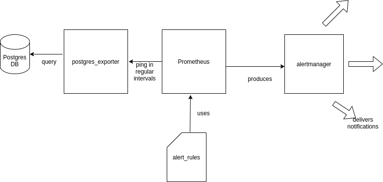

<!-- PROJECT LOGO -->
 

  <h3 align="center">Prometheus based alert system</h3>

  

    Implementing prometheus based alert mechanism to generate alerts for the user specified database changes.
  

<!-- ABOUT THE PROJECT -->
## About The Project
The system detects user defined database events and generate alerts for the users. System is based around prometheus and uses postgres_exporter as we are monitoring postgres database. Alertmanager is used to generate alerts which are produced by Prometheus.

The architecture diagram of the system is follows

<!-- GETTING STARTED -->
## Getting Started

To get up and runing the project follow the following steps.

### Prerequisites

- Docker 
- Postgresql

### Steps

1. To setup prometheus server instructions are in [here](prometheus/README.md). 
2. To setup postgres_exporter instructions are in [here](postgres_exporter/README.md).
3. To setup alertmanager instructions are in [here](alertmanager/README.md).

   

